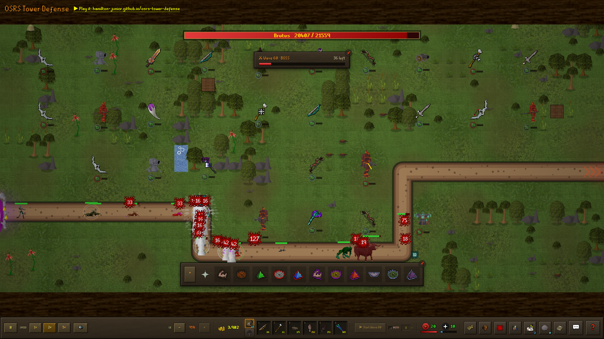
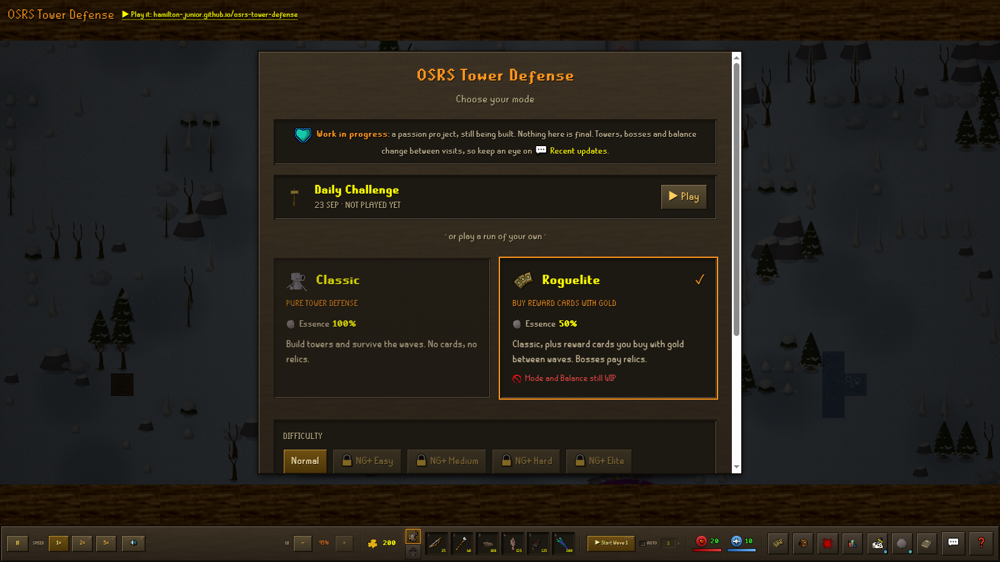
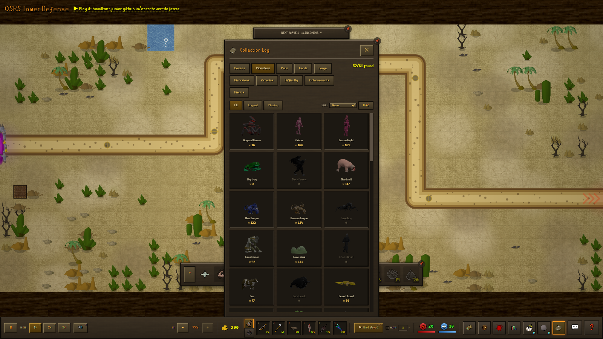

# OSRS Tower Defense

We rebuilt Old School RuneScape as a tower defense game. It runs in your browser,
talks to no server, and every sprite and sound in it came out of the real OSRS
game cache.

### ▶ [Play it](https://hamilton-junior.github.io/osrs-tower-defense/)

Nothing to install and no account to make. Your progress lives in the browser,
and a save code carries it to another machine.



## How a run goes

You defend one board, 45×20 tiles at a fixed 1440×640. Everyone plays that same
board, and you get a different road cut through it every run. Monsters walk that
road end to end. You build beside it, upgrade what you built, and lose one of
your 20 lives every time something reaches the far side.

You meet a boss every tenth wave. Kill one and the road forks: you pick where to
march next out of seven regions, the Kharidian desert, Morytania's swamp, the
Wilderness, Trollweiss snow, the Karamja jungle, the TzHaar caverns and the
Misthalin plains you started on. Your towers, your terrain and the bends you paid
to carve all survive the move. Only the palette, the monsters native to the place
and the diary tasks change. Put down every boss a run schedules and you win at
wave 130. Endless keeps counting after that, for as long as you last.

| Mode | What it is |
|---|---|
| **Classic** | Build towers, survive waves. No cards, no relics. |
| **Roguelite** | Classic, plus reward cards you buy with gold between waves. Each boss pays a relic that rewrites a rule of the whole run. |

You also pick a difficulty, seven tiers named after the OSRS Combat Achievement
tiers. Start on Normal; win once and the tier above it opens, up to Grandmaster:
2.8× enemy HP, 30% less gold per kill, five lives instead of twenty.



## What you get to play with

**Six towers, and six more you forge.** Archer, Wizard, Cannon, TzHaar, Slayer
and Toxic each climb a tier ladder built from real OSRS gear. Every one owns a
niche the Wizard cannot cover, so none of them is a worse version of another.
Stand two finished towers of the right pair on adjacent tiles, pay the fee, and
they fuse into one weapon: a Scorching bow, a Venator bow, a Noxious halberd, a
Purging staff, a Toxic staff of the dead or an Eclipse atlatl. A fusion does
something no quantity of its parents can.

**Sixty-one monsters and fourteen bosses**, plus the minions they call in. Each
boss fights back with a mechanic of its own. Zulrah rotates through forms that
answer to one combat style at a time, Jad calls Yt-HurKot healers that drain the
damage you just dealt, and the Corporeal Beast siphons a tower so its shot never
leaves the barrel. Ordinary monsters roll affixes, so a goblin can turn up
Volatile and knock your towers offline when it dies, or Warded against every
freeze you own.

**Wizards choose a spellbook.** Elemental picks an element and hits one target.
Ancients barrage a crowd with ice, blood, shadow or smoke. Utility buys you
curses and sanctity instead of damage.

**OSRS skills, doing OSRS jobs.** Slayer masters hand out tasks. Prayer burns
points for damage and protection. Herblore brews potions you drink for a stretch
of waves. Farming, Fishing and Hunter fill the gaps between fights, and none of
them asks you for timing or clicks per second.

**Things to chase.** A Collection Log, a Bestiary you can rotate the models in,
Combat Achievements, Achievement Diaries per region, boss pets, and an Essence
Shop where clearing waves buys permanent upgrades for every run after.



**A daily challenge.** You and everybody else get the same map and the same boss
order each UTC day. Replay it as often as you like; the scoreboard keeps your
best.

## Run it locally

```bash
npm install
npm run dev        # http://localhost:3000
```

`npm install` resolves clean. `next` is pinned to 15.4.11, which peer-accepts the
React 19.2 the app runs on.

| Command | What it does |
|---|---|
| `npm run dev` | Next.js dev server |
| `npm run build` | Static export to `out/` |
| `npm run test` | Vitest, 1,703 tests across 70 files |
| `npm run lint` | ESLint, advice only |

Before you claim a change works, run `npx tsc --noEmit`, then `npx vitest run`,
then `npm run build`. Type errors fail the build; lint errors do not. The
`.claude/skills/game-verify` skill explains how to drive the exported game in a
headless browser when the gate cannot tell you what you need to know.

## How it is put together

One imperative class runs the game, one React component draws the interface, and
we keep the two apart on purpose.

- [`lib/game/core/engine.ts`](lib/game/core/engine.ts) owns the state, the
  `requestAnimationFrame` loop and every method the interface calls. The
  simulation itself lives under [`core/sim/`](lib/game/core/sim/).
- [`lib/game/core/renderer.ts`](lib/game/core/renderer.ts) owns every Canvas 2D
  draw call and keeps no state of its own. Each layer is a module under
  [`core/render/`](lib/game/core/render/).
- [`components/game/GameRoot.tsx`](components/game/GameRoot.tsx) is the React
  bridge and the whole OSRS interface.

React never touches a game entity. The engine pushes `Partial<UIState>` patches
up; the interface calls methods back down. Game rules live in
[`lib/game/systems/`](lib/game/systems/) as pure functions with tests beside
them, which is where the whole safety net sits. Static content lives in
[`lib/game/data/`](lib/game/data/).

[`CLAUDE.md`](CLAUDE.md) documents the boundaries in full, and the four skills in
`.claude/skills/` carry the detailed rules for the interface, for new content,
for verification and for commit messages.

## Where the art comes from

The scripts in [`scripts/`](scripts/) bake every sprite, model render, animation
frame and sound effect out of a local OSRS cache. We hot-link nothing from the
wiki or anywhere else, and a test fails the build if a data table names an icon
with no bake behind it. The OSRS pixel fonts are RuneStar's CC0
recreations, self-hosted in `app/fonts/`.

Rendering an enemy takes three steps: export it as an animated glTF, bake the
walk, hurt and death sheets with three.js, then regenerate the animation tables.
Picking *which* cache sequence is a death animation is its own problem, and
`npm run anims:triage <slug>` exists because guessing at it wastes hours.

## Deploy

The game is a static site, so GitHub Pages serves it with no server behind it.

1. **Settings → Pages → Build and deployment → Source: GitHub Actions**.
2. Push to `main`. [`.github/workflows/deploy.yml`](.github/workflows/deploy.yml)
   builds the export and publishes it.

The workflow sets `NEXT_PUBLIC_BASE_PATH=/<repo-name>` so assets resolve under the
project subpath. To build that bundle by hand:

```bash
NEXT_PUBLIC_BASE_PATH=/osrs-tower-defense npm run build   # serve ./out
```

## Tell us what broke

The 💬 button in game opens a bug form, a suggestion form and an invite to the
[Discord](https://discord.gg/TdJQJXPkzF). Reports go into a triage ledger, and
when we build one it turns up in the in-game "Recent updates" list with a 💬
beside it.

## Built with

Next.js App Router, React 19, TypeScript, HTML Canvas, Tailwind v4 over
hand-rolled OSRS CSS. No backend, and none planned.

Old School RuneScape belongs to Jagex Ltd. This is an unofficial fan project, not
affiliated with or endorsed by Jagex.
